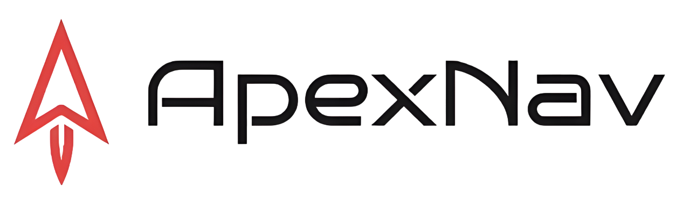

<div align="center">
    
    <h2>An Adaptive Exploration Strategy for Zero-Shot Object Navigation with Target-centric Semantic Fusion</h2>
    <strong>

</div>

> Built on ApexNav.

This repository is a lightweight ObjectNav variant based on ApexNav. The overall Habitat + ROS pipeline is kept, while the current VLM stack in this repo uses `YOLOE` for detection and `CLIPITM` for image-text matching.

## 🛠️ Installation

> Tested on Ubuntu 20.04 with ROS Noetic and Python 3.10

Please install [ROS](https://www.ros.org/) first. It is also recommended to use [Anaconda](https://www.anaconda.com/) or [Miniconda](https://docs.conda.io/en/latest/miniconda.html) to manage the Python environment.

### 1. Prerequisites

#### 1.1 System Dependencies

```bash
sudo apt update
sudo apt-get install libarmadillo-dev libompl-dev

# OSQP
git clone --recursive -b v0.6.3 https://github.com/osqp/osqp.git
cd osqp && mkdir build && cd build
cmake .. -DBUILD_SHARED_LIBS=ON && make -j && sudo make install
cd ../..

# OSQP-Eigen
git clone -b v0.8.1 https://github.com/robotology/osqp-eigen.git
cd osqp-eigen && mkdir build && cd build
cmake .. && make -j && sudo make install
cd ../..
```

#### 1.2 LLM (Optional)

You can use Ollama locally:

```bash
curl -fsSL https://ollama.com/install.sh | sh
ollama pull qwen3:8b
```

If you do not want to use an LLM, change `llm.llm_client.llm_client` to `none` in the config files under `config/`.

#### 1.3 Model Weights Download

Download the following model weights and place them in the `data/` directory:

```bash
mkdir -p data
```

- `yoloe-11l-seg.pt`:

```bash
wget -O data/yoloe-11l-seg.pt https://github.com/ultralytics/assets/releases/download/v8.4.0/yoloe-11l-seg.pt
```

### 2. Setup Python Environment

#### 2.1 Clone Repository

```bash
git clone -b Lite-Apexnav git@github.com:Robotics-STAR-Lab/ApexNav.git
cd ApexNav
```

#### 2.2 Create Conda Environment

```bash
conda create -n apexnav python=3.10 -y
conda activate apexnav
```

#### 2.3 PyTorch

```bash
# You can use 'nvcc --version' to check your CUDA version.
# CUDA 11.8
pip install torch==2.5.1 torchvision==0.20.1 torchaudio==2.5.1 --index-url https://download.pytorch.org/whl/cu118
# CUDA 12.1
pip install torch==2.5.1 torchvision==0.20.1 torchaudio==2.5.1 --index-url https://download.pytorch.org/whl/cu121
# CUDA 12.4
pip install torch==2.5.1 torchvision==0.20.1 torchaudio==2.5.1 --index-url https://download.pytorch.org/whl/cu124
```

#### 2.4 Habitat Simulator

We recommend using `habitat-sim v0.3.1` and `habitat-lab v0.3.1`.

```bash
# habitat-sim v0.3.1
git clone --branch stable https://github.com/facebookresearch/habitat-sim.git
cd habitat-sim
git checkout tags/v0.3.1
pip install -r requirements.txt
export CUDACXX=/usr/local/cuda/bin/nvcc
export CUDA_HOME=/usr/local/cuda
export PATH=/usr/local/cuda/bin:$PATH
python setup.py install --bullet --with-cuda
cd ..
```

```bash
# habitat-lab / habitat-baselines v0.3.1
git clone https://github.com/facebookresearch/habitat-lab.git
cd habitat-lab
git checkout tags/v0.3.1
pip install -e habitat-lab
pip install -e habitat-baselines
cd ..
```

**Note:** Numpy-related warnings or dependency-conflict messages during Habitat installation can usually be ignored. Installing this repository in the next step will pin the required versions, including `numpy==1.23.5` and `numba==0.60.0`.

#### 2.5 Install This Repository

```bash
pip install -e .
```

## 📥 Datasets Download
> Official Reference: https://github.com/facebookresearch/habitat-lab/blob/main/DATASETS.md

### 🏠 Scene Datasets
**Note:** Both HM3D and MP3D scene datasets require applying for official permission first. You can refer to my commands below, and if you encounter any issues, please refer to the official documentation at https://github.com/facebookresearch/habitat-lab/blob/main/DATASETS.md.

#### HM3D Scene Dataset
1. Apply for permission at https://matterport.com/habitat-matterport-3d-research-dataset.
2. Download https://api.matterport.com/resources/habitat/hm3d-val-habitat-v0.2.tar.
3. Save `hm3d-val-habitat-v0.2.tar` to the `ApexNav/` directory, and the following commands will help you extract and place it in the correct location:
``` bash
mkdir -p data/scene_datasets/hm3d/val
mv hm3d-val-habitat-v0.2.tar data/scene_datasets/hm3d/val/
cd data/scene_datasets/hm3d/val
tar -xvf hm3d-val-habitat-v0.2.tar
rm hm3d-val-habitat-v0.2.tar
cd ../..
ln -s hm3d hm3d_v0.2 # Create a symbolic link for hm3d_v0.2
```

#### MP3D Scene Dataset
1. Apply for download access at https://niessner.github.io/Matterport/.
2. After successful application, you will receive a `download_mp.py` script, which should be run with `python2.7` to download the dataset.
3. After downloading, place the files in `ApexNav/data/scene_datasets`.

### 🎯 Task Datasets
``` bash
# Create necessary directory structure
mkdir -p data/datasets/objectnav/hm3d
mkdir -p data/datasets/objectnav/mp3d

# HM3D-v0.1
wget -O data/datasets/objectnav/hm3d/v1.zip https://dl.fbaipublicfiles.com/habitat/data/datasets/objectnav/hm3d/v1/objectnav_hm3d_v1.zip
unzip data/datasets/objectnav/hm3d/v1.zip -d data/datasets/objectnav/hm3d && mv data/datasets/objectnav/hm3d/objectnav_hm3d_v1 data/datasets/objectnav/hm3d/v1 && rm data/datasets/objectnav/hm3d/v1.zip

# HM3D-v0.2
wget -O data/datasets/objectnav/hm3d/v2.zip https://dl.fbaipublicfiles.com/habitat/data/datasets/objectnav/hm3d/v2/objectnav_hm3d_v2.zip
unzip data/datasets/objectnav/hm3d/v2.zip -d data/datasets/objectnav/hm3d && mv data/datasets/objectnav/hm3d/objectnav_hm3d_v2 data/datasets/objectnav/hm3d/v2 && rm data/datasets/objectnav/hm3d/v2.zip

# MP3D
# Note: the upstream download URL uses "m3d", while the local dataset path is "mp3d".
wget -O data/datasets/objectnav/mp3d/v1.zip https://dl.fbaipublicfiles.com/habitat/data/datasets/objectnav/m3d/v1/objectnav_mp3d_v1.zip
mkdir -p data/datasets/objectnav/mp3d/v1
unzip data/datasets/objectnav/mp3d/v1.zip -d data/datasets/objectnav/mp3d/v1 && rm data/datasets/objectnav/mp3d/v1.zip
```

<details>
<summary>Make sure that the folder `data` structure has the following structure:</summary>

```
data
├── datasets
│   └── objectnav
│       ├── hm3d
│       │   ├── v1
│       │   │   ├── train
│       │   │   ├── val
│       │   │   └── val_mini
│       │   └── v2
│       │       ├── train
│       │       ├── val
│       │       └── val_mini
│       └── mp3d
│           └── v1
│               ├── train
│               ├── val
│               └── val_mini
├── scene_datasets
│   ├── hm3d
│   │   └── val
│   │       ├── 00800-TEEsavR23oF
│   │       ├── 00801-HaxA7YrQdEC
│   │       ├── .....
│   ├── hm3d_v0.2 -> hm3d
│   └── mp3d
│       ├── 17DRP5sb8fy
│       ├── 1LXtFkjw3qL
│       ├── .....
└── yoloe-11l-seg.pt
```

Note that `train` and `val_mini` are not required and you can choose to delete them.
</details>

## 🚀 Usage

> All commands below should be run in the `apexnav` conda environment.

### 1. Build the ROS workspace

```bash
catkin_make -DPYTHON_EXECUTABLE=/usr/bin/python3
```

This uses the system Python expected by ROS Noetic. Keep the `apexnav` conda environment active for the Python VLM and Habitat commands below.

### 2. Start VLM servers

Run each command in a separate terminal:

```bash
python -m vlm.itm.clipitm --port 12182
python -m vlm.detector.yoloe --port 12184
```

Wait until the YOLOE terminal prints `YOLOE warmup complete!` and `Hosting on port 12184...` before starting Habitat evaluation.

### 3. Launch RViz and the main planner

```bash
source ./devel/setup.bash && roslaunch exploration_manager rviz.launch
source ./devel/setup.bash && roslaunch exploration_manager exploration.launch
```

### 4. Evaluate datasets in Habitat

```bash
source ./devel/setup.bash

python habitat_evaluation.py --dataset hm3dv1
python habitat_evaluation.py --dataset hm3dv2
python habitat_evaluation.py --dataset mp3d

# Evaluate one specific episode
python habitat_evaluation.py --dataset hm3dv2 test_epi_num=10

# Save evaluation videos
python habitat_evaluation.py --dataset hm3dv2 need_video=true
```

### 5. Manual control in Habitat

```bash
source ./devel/setup.bash

python habitat_manual_control.py --dataset hm3dv1
python habitat_manual_control.py --dataset hm3dv2
python habitat_manual_control.py --dataset mp3d

# Run one specific episode
python habitat_manual_control.py --dataset hm3dv2 test_epi_num=10
```
